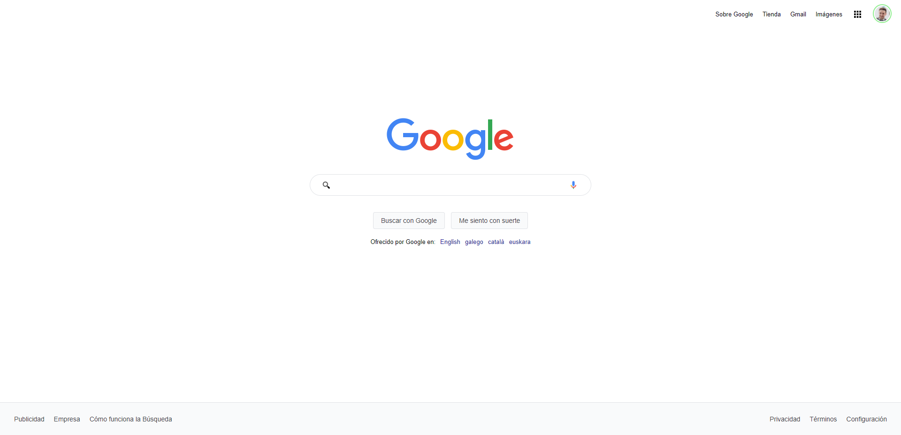

# Clon de Google

Este proyecto clon simula al buscador Google. Construido a partir del curso de HTML y CSS de Platzi.

## Captura de pantalla

## Enlaces

- URL del repositorio: https://github.com/creativoma/clone-google
- URL del sitio en vivo: http://clone-google-six.vercel.app/

## Construido con

- HTML y CSS
- Flexbox y Grid

## Autor

- Sitio web: https://creativoma.com/
- Twitter: https://twitter.com/MarianoNobell
